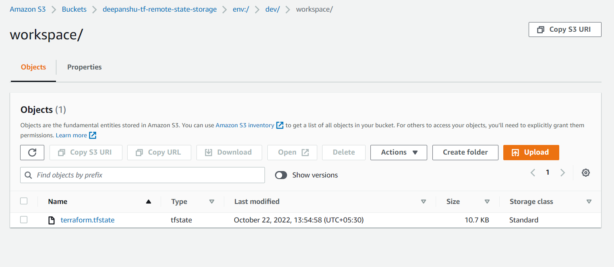

# Terraform Workspaces

Terraform starts with a single workspace name "default". This "default" workspace can never be deleted.

By default, we are working in default workspace. Named workspaces allow conveniently switching between multiple instances of 
single configuration within its single backend.

A common use for multiple named workspaces is to create a parallel, distinct copy of a set of infrastructure in order to test
a set of changes before modifying the main production infrastructure.

Terraform CLI workspaces are completely different from Terraform Cloud workspaces. Every terraform workspace will have its
own ```terraform.tfstate``` file.

- Every initialized directory will have at least one workspace.
- For a given working directory, only one workspace can be selected.

Terraform workspace commands:

```shell
$terraform workspace show
$terraform workspace list
$terraform workspace new <workspace name>
$terraform workspace select <workspace name>
$terraform workspace delete <workspace name>
```

For Terraform workspace implementation using local state, refer [ec2-create.tf](10a-Terraform-Workspaces-local/ec2-create.tf).

Creating a new workspace, creates following directory structure.

- terraform.state.d/dev
- terraform.state.d/dev/terraform.tfstate

If we try to delete a workspace which is managing resources/not empty, we get below error.

```shell
terraform workspace delete dev 

# Error: Workspace is not empty
#
# Workspace "dev" is currently tracking the following resource instances:
#   - aws_instance.ec2-east[0]
#   - aws_security_group.vpc_ssh_web
#
# Deleting this workspace would cause Terraform to lose track of any associated remote objects, which would then require you to delete them manually outside of Terraform. You should destroy 
# these objects with Terraform before deleting the workspace.
#
# If you want to delete this workspace anyway, and have Terraform forget about these managed objects, use the -force option to disable this safety check.


```


When we create a terraform workspace using remote backend, a different S3 bucket structure gets created. Here is the snippet
for your reference.


